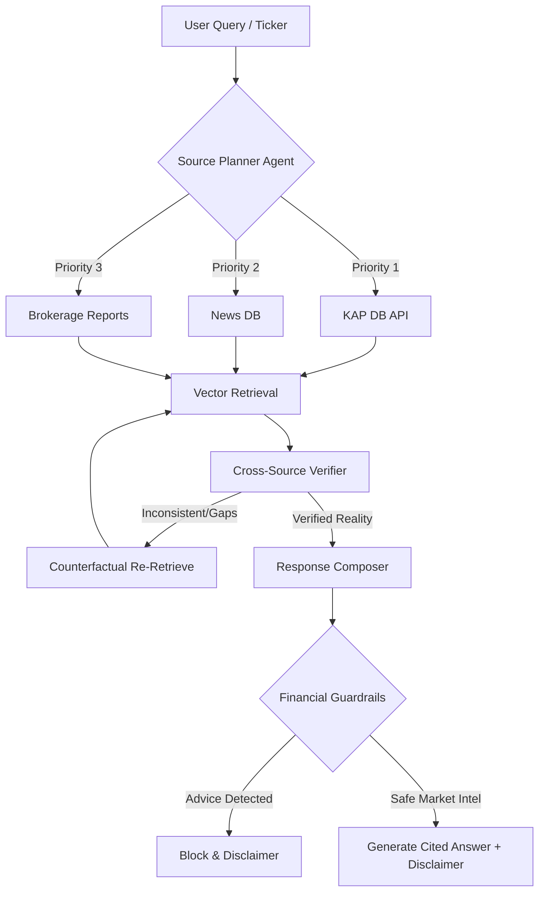

# BIST Agentic RAG v2.0 (Final Optimized Blueprint)

🚀 **[Click Here to view the Interactive FinTech Rubric Report & Documentation!](https://dommlee.github.io/rag-projesi/docs/)**

Agentic RAG system for Turkish equity intelligence (BIST/KAP/Broker/News), with explicit non-advisory guardrails.

## Real Project Upgrades (v2.0)
- Persistent job registry (SQLite-backed) for ingestion/eval jobs across restarts
- **Persistent ClaimLedger and MemoryStore** (SQLite-backed) — ledger of supported /
  unsupported claims and weekly ticker snapshots survive restart
- **Public KAP REST API client** (`app/ingestion/kap_api.py`) — primary path for
  KAP disclosures (uses `search/combined` + `disclosure/members/byCriteria`),
  HTML scraper retained as graceful fallback
- **Expanded Turkish news coverage** — 14 RSS feeds across Dünya, Mynet, Habertürk,
  Sözcü, Foreks, Investing.com TR, plus existing wire services
- **RAGAS + DeepEval heuristic proxies** — both harnesses now ship numeric metrics
  in CI (faithfulness, answer_relevancy, context_precision/recall, hallucination_rate)
  via lexical-overlap proxies when API keys are missing, and switch to the real
  libraries automatically when `OPENAI_API_KEY` is set
- CI pipeline via GitHub Actions (`.github/workflows/ci.yml`)
- Environment validator script (`scripts/validate_env.py`)
- Docker context optimization (`.dockerignore`)

## System Architecture Flow


## Core Capabilities
- KAP REST API ingestion + HTML scraper fallback
- News RSS/HTML ingestion (14 Turkish feeds)
- Brokerage PDF ingestion + OCR fallback
- Weaviate-backed retrieval with metadata-first filtering
- Agentic loop: `retrieve -> verify -> re-retrieve -> answer`
- Cross-source consistency analysis (`aligned|contradiction|inconclusive`)
- Bilingual TR/EN answers with citations and as-of awareness
- Mandatory disclaimer in all outputs
- Live market prices (`yfinance` primary + fallback + cache)
- Dynamic BIST ticker universe with priority queue
- Modern Next.js dashboard (`frontend/`) with SSE live panels

## Hard Ethical Rule
`This system does not provide investment advice.`

## Gap-Closure Features Added
- Delta/idempotent ingestion via SQLite `document_registry`
- Legal-safe crawler policy (robots + rate limit + backoff + failover feed)
- Embedding providers: `ollama`, `openai`, `voyage`, `nomic`, `local`
- Reasoning providers: `groq`, `gemini`, `openai`, `ollama`, `together`, `mock`
- Weaviate strict mode (optional no-fallback)
- Retrieval trace logging (`metadata filter -> vector search -> time-decay rerank`)
- Hybrid evaluation modes (`mock|hybrid|real`) with rubric scoring
- Eval artifacts: JSON + Markdown report
- Empty-corpus auto-seeding for eval fixtures (explicitly marked in eval notes)
- Dashboard with job status, metrics, latest eval access, last errors
- Streamlit application (`streamlit_app.py`) with Query/Ingestion/Eval/Narrative tabs

## API Endpoints
- `GET /` dashboard
- `POST /v1/query`
- `POST /v1/query/insight`
- `POST /v1/provider/validate`
- `POST /v1/ingest/kap`
- `POST /v1/ingest/news`
- `POST /v1/ingest/report`
- `POST /v1/jobs/ingest/{kap|news|report}`
- `GET /v1/jobs`
- `GET /v1/jobs/{job_id}`
- `POST /v1/eval/run`
- `GET /v1/eval/report/latest`
- `GET /v1/health`
- `GET /v1/ready`
- `GET /v1/metrics`
- `GET /v1/providers`
- `GET /v1/market/universe`
- `GET /v1/market/prices?ticker=ASELS,THYAO`
- `GET /v1/stream/metrics`
- `GET /v1/stream/ingest`
- `GET /v1/diagnostics/{ticker}`
- `GET /v1/auto-ingest/status`
- `GET /v1/auto-ingest/config`
- `POST|PUT /v1/auto-ingest/config`
- `POST /v1/auto-ingest/start`
- `POST /v1/auto-ingest/stop`
- `POST /v1/auto-ingest/run-once`

### Runtime Provider Override (Per Query)
`POST /v1/query` now supports `provider_overrides` so each user can use their own local Ollama or API keys without editing server `.env`.

Example:
```json
{
  "ticker": "ASELS",
  "question": "Son KAP ve haber anlatısını özetle.",
  "provider_pref": "ollama",
  "provider_overrides": {
    "ollama_base_url": "http://localhost:11434",
    "ollama_model": "llama3.1:8b"
  }
}
```

## Windows Profiles
- One-click normal desktop app (silent): `100_open_desktop_app.vbs`
- One-click normal desktop app (bat): `100_open_desktop_app.bat`
- Desktop auto-starts API/worker on launch (toggleable in GUI)
- Desktop GUI app: `120_desktop_app.bat`
- Desktop EXE build: `130_build_desktop_exe.bat`
- Application launch: `100_run_app.bat`
- Application stop: `101_stop_app.bat`
- Fast demo: `fast_demo.bat`
- Full evaluation: `full_eval.bat`
- Full pipeline logs: `99_full_pipeline.bat`
- Modern web app launcher: `110_run_modern_app.bat`
- Next.js UI only: `36_run_web_ui.bat`
- Streamlit app launch: `35_run_streamlit.bat`
- Auto ingest start: `21_auto_ingest_start.bat`
- Auto ingest status: `22_auto_ingest_status.bat`
- Auto ingest stop: `23_auto_ingest_stop.bat`
- Auto ingest configure: `24_auto_ingest_configure.bat`
- Auto ingest run-once: `26_auto_ingest_run_once.bat`
- Provider validate: `31_validate_provider.bat`
- Optional fixture seeding step: `25_seed_eval_corpus.bat`
- Service cleanup step: `70_stop_services.bat`
- Release bundle step: `80_release_bundle.bat`
- GitHub readiness step: `90_github_ready.bat`
- Publish step: `95_publish_git.bat` (set `REPO_URL` for first push)

## Resilience Flags
- `SKIP_OLLAMA_PULL=1`: skip model pull in `00_setup.bat`
- `ALLOW_LOCAL_FALLBACK=1`: if Docker daemon is unavailable, run API/worker locally in `30_run_api.bat`

## Setup
1. Copy `.env.example` to `.env`
2. Configure keys if needed (`OPENAI_API_KEY`, `TOGETHER_API_KEY`, etc.)
3. Run one profile:
```bat
fast_demo.bat
```
or
```bat
full_eval.bat
```
4. Launch modern app (API + worker + Next.js UI):
```bat
110_run_modern_app.bat
```

## Port Fallback
`30_run_api.bat` selects the first free port from:
- `18000`
- `18001`
- `18002`
- `8088`

Selected port is persisted in `logs/.runtime_api_port` and reused by `40_smoke_test.bat`.

## Evaluation Modes
- `mock`: deterministic low-cost baseline
- `hybrid`: mix of mock + real provider where available
- `real`: fully real provider path

v1.2 default behavior is heuristic-first for assignment stability. Report includes:
- `evaluation_mode_effective`
- `real_provider_available`
- `heuristic_metrics`
- `gate_results`
- `model_based_metrics` (`not_run` when LLM judge is disabled)

## Offline Eval Fixture Command
```bat
.venv\Scripts\python scripts\seed_eval_corpus.py --dataset-path datasets/eval_questions.json --only-if-empty
```

## Tests
```bash
python -m pytest -q
```

## Deliverable Docs
- [Architecture Diagram](/D:/rag projesi/docs/architecture.mmd)
- [Trade-off Matrix](/D:/rag projesi/docs/tradeoff_matrix.md)
- [Runbook](/D:/rag projesi/docs/runbook.md)
- [Troubleshooting](/D:/rag projesi/docs/troubleshooting.md)
- [Final Demo Script](/D:/rag projesi/docs/final_demo_script.md)
- [Rubric Mapping](/D:/rag projesi/docs/rubric_mapping.md)
- [Latest Run Summary](/D:/rag projesi/docs/latest_run_summary.md)
- [Release Checklist](/D:/rag projesi/docs/release_checklist.md)
- [GitHub Ready Status](/D:/rag projesi/docs/github_ready_status.md)
- [App Quickstart](/D:/rag projesi/docs/app_quickstart.md)
- [Production Readiness](/D:/rag projesi/docs/production_readiness.md)
